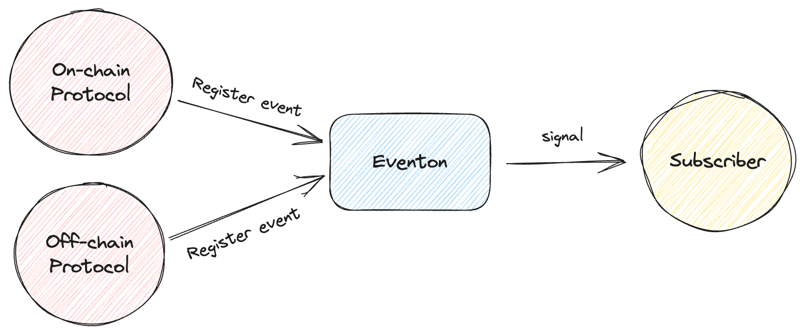

# Protocol

## Introduction

The **Protocol** plays a pivotal role within our system, serving as the main source of signals.



Drawing from the above explanation, we can categorize it into two main types:

- **On-chain Protocol**: These protocols predominantly represent a majority of DeFi protocols. They offer services like lending, trading, insurance, and more, all of which are executed on-chain. Hence, we term them as On-chain Protocols.

- **Off-chain Protocol**: These protocols cater to data from off-chain sources, such as oracles. The computations and interactions for these data points occur off-chain, leading us to define them as Off-chain Protocols.

## Prepare: Just `Alertable`

To send signal, you need to prepare a contract with our template interface `Alertable`.

```typescript
trait Alertable with Ownable {
    owner: Address;
    protocolName: String; // Protocol name
    eventonAddress: Address; // Eventon address
    ...
    receive(msg : ProtocolRegister) { ... }
}
```

To register a protocol, you need to implement the `receive` function with message `ProtocolRegister`.

```typescript
receive(msg : ProtocolRegister) {
    self.requireOwner();
    send(SendParameters{
        to: self.eventonAddress,
        value: 0,
        bounce: false,
        mode: SendRemainingValue,
        body: ProtocolRegister{
            sourceAddress: myAddress(), // Protocol's address
            template: msg.template, // Callback contract for subscribers
            maxUserStakeAmount: msg.maxUserStakeAmount, // Maximum amount of stake that a user can stake for the protocol
            subscribeFeePerTick: msg.subscribeFeePerTick // Amount of fee that a subscriber has to pay for each tick
        }.toCell()
    });
}
```

## Functionality

### Registering an Event

To register an event for signal provision, the following details are required:

- `template`: The default contract init code, serving as a template for subscribers to receive signals.
- `maxUserStakeAmount`: The maximum amount a subscriber can stake.
- `subscribeFeePerTick`: The fee payable by subscribers for each tick.

### Sending Signals

For a registered event, signals can be dispatched. The necessary details include:

- `eventId`: The unique ID associated with the event.
- `payload`: The content of the signal being sent.

### Collecting Subscription Fee

Withdrawals can be made from the profit pool. The required information is:

- `amount`: The sum of accumulated subscription earnings to be withdrawn.
- `receiver`: The intended recipient of the earnings.
