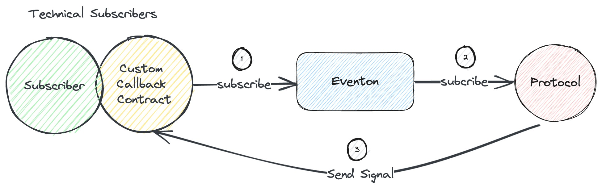
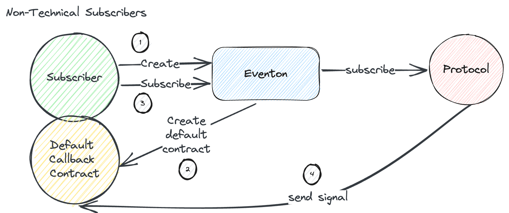

# Subscriber

## Introduction

Subscribers can choose from various event subscriptions within the Eventon Protocol.

- If a subscriber is a programmer themselves, they can write their own program logic for handling signals and take relevant actions upon receiving event signals.
- If a subscriber is not a programmer, they can use templates provided by event providers to receive signals and execute actions related to event signals.

## Workflow

- Non-Technical Subscribers
  

- Technical Subscribers
  

## Functionality

### Create a User Default Callback Contract

- For non-technical subscribers who may not have programming skills, you can register a default callback contract using the template provided by the Protocol. This contract facilitates signal reception and executing related actions upon receiving signals.

  Subscribers can register the Default Callback Contract by providing the following information:

  - `walletAddress`: The subscriber's wallet address.
  - `deadline`: The maximum delay that the callback contract can accept for processing event signals sent by the Protocol.
  - `eventId`: The subscribed Protocol signal event ID (0: Oracle signals, 1: Smart Contract Vulnerability Detection).
  - `parameter`: Relevant parameters required by the callback contract.

### Custom Callback Contract for Advanced User

For technical subscribers with programming capabilities, you have the option to write your own custom Callback contract to facilitate signal reception and execute related actions upon receiving event signals.

### Subscribe Events on Eventon

Once subscribers have their own Callback contract address, provide the following relevant information to subscribe to Eventon:

- `walletAddress`: Subscriber's wallet address.
- `deadline`: The maximum delay that the callback contract can accept for processing event signals sent by the Protocol.
- `eventId`: The subscribed Protocol signal event ID (0: Oracle signals, 1: Smart Contract Vulnerability Detection).
- `callback` contract address: The contract address responsible for receiving event signals (Default callback contract address/ Custom callback contract address).
