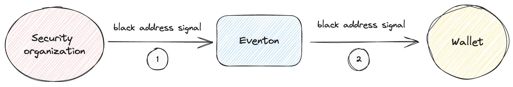

# Away from Blacklist

## Introduction

One such use case of this innovative system is the Blacklist functionality. This document delves deep into how professional entities can leverage Eventon to dispatch signals from off-chain, signifying updates to a blacklist.

## Workflow

## Detail

### Event Signal

A professional entity or organization detects or decides upon a new blacklist addition based on its internal criteria.
The entity then sends out a signal from off-chain. This signal encompasses critical details about the blacklisted entity:

- `Message`: The primary information or alert about the blacklist.
- `Info`: Supplementary details, possibly outlining the rationale for the blacklist and its category.

### Subscription

Users who have subscribed to these blacklist events via Eventon will receive these signals. The powerful customization options in Eventon allow users to define their interaction logic upon receiving such signals.

### Interaction Logic

Upon detecting a signal from a blacklisted address, users might set up preventive measures such as:

- Refusing funds or transactions from the blacklisted address.
- Denying interaction with malicious contracts.
  This ensures that users remain shielded from potential threats or undesirable interactions.

## Conclusion

The Blacklist functionality, powered by Eventon's on TON blockchain, epitomizes the blend of security, flexibility, and automation. By leveraging signals, users can maintain a dynamic and responsive stance against threats, ensuring that their transactions and interactions on the blockchain remain secure and uncompromised.
