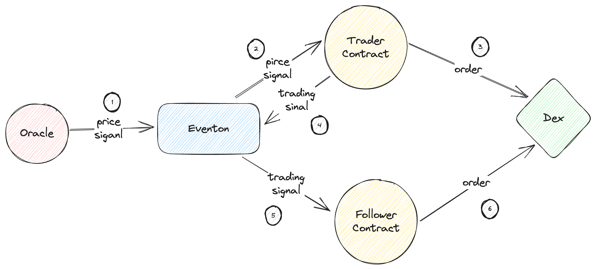

# Copy Trading

## Introduction

- Eventon's online copy trading subscription system aims to connect experienced traders (signal providers) with investors (subscribers).
- The core concept of the system: Subscribers can replicate the trading strategies of signal providers, thereby benefiting from their expertise and successful trading decisions.

## Workflow



1. Trader Subscribes to Oracle Events: Traders initially choose to subscribe to one or more Oracle events that provide real-time market prices and information. The Oracle regularly sends these price signals to the trader's smart contract.

- Trader receive price event signal:

```typescript
receive(msg: EventSignal) {
        let cxt: Context = context();
        if(cxt.sender != self.messenger) {
            throw(009); // Only messenger can send signal;
        }
        let payload: Cell = msg.payload;
        let parser: Slice = payload.beginParse();
        let price: Int = parser.loadInt(32); // The price sent by the oracle event

        // Trader's trading logic code...

}
```

2. Signal Provider Registration: Traders interested in becoming signal providers can register with Eventon. They need to provide relevant details and agree to adhere to Eventon's terms and conditions. After trader registered, they will send trading signal to followers

- Trader send their trading message to followers

```typescript
send(SendParameters{
    to: self.dex,
    value: value,
    mode: SendPayGasSeparately,
    bounce: true,
    body: Trade {
        orderAction: self.orderAction,
        assets: self.assets,
        positionSize: self.positionSize
    }.toCell()
});
```

3. Subscriber Subscribes to Signals: Investors can browse different signal providers on the Eventon platform, reviewing their past performance and trading strategies. Once they select a signal provider, subscribers can easily subscribe to their trading signals.

4. Trade Execution: When a signal provider executes buy or sell trades, the detailed information is transmitted to the Eventon system. Eventon verifies these trades and then sends the relevant information to all subscribers who have subscribed to that signal provider. This allows subscribers to replicate the signal provider's trades in real-time.

- Subscriber receives trading message from subscriber

```typescript
message Trade {
    orderAction: Int;
    assets: self.assets
    positionSize: Int;
}
```

## Details

### Event Signal

The system employs a logic for detecting signal events initiated by signal providers. When a signal provider initiates a trade, the system captures the following information:

- Order Action: Indicates whether it's a buy or sell order.
- Asset: Specifies the asset or instrument being traded.
- Position Size: The margin used for opening the position.

### Subscriber Signal Replication

Subscribers can choose to replicate received signals with their own trading accounts. The system facilitates this process by allowing subscribers to set their preferred parameters:

- Signal Delay: Subscribers can introduce a delay in signal replication to accommodate their trading strategies.
- Risk Management: Subscribers can define their risk tolerance levels and position sizes based on the received signals.
- Auto-Execution: For subscribers opting for automated trading, the system can execute trades directly on their behalf based on the received signals.

## Conclusion

- Eventon's copy trading provides an effective way for traders and investors to share and benefit from trading strategies.
- This system, by offering real-time market data and signals, along with transparent trading histories, contributes to creating a fairer and more transparent financial ecosystem.
- The success of copy trading relies on effective risk management and intelligent investment decisions, which help all participants achieve their financial goals.
