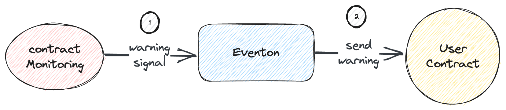

# Vulnerable Contract Alert

## Introduction

- The VulnerableContractAlert system is designed to detect and alert users to potential vulnerabilities in smart contracts within blockchain networks.
- Smart contracts are critical components of blockchain ecosystems, and identifying vulnerabilities is essential to prevent security breaches and financial losses.

## Workflow

1. Contract Monitoring: The system continuously monitors smart contracts deployed on blockchain networks. It scans contract code and transactions for potential vulnerabilities and suspicious behavior.

2. Vulnerability Detection: Using a combination of automated code analysis and pattern recognition, the system identifies vulnerabilities such as reentrancy bugs, integer overflow, and other common smart contract vulnerabilities.

3. Alert Generation: When a potential vulnerability is detected, the system generates an alert. The alert includes details about the contract, the detected vulnerability, and its potential impact.

4. Alert Distribution: Alerts are distributed to relevant stakeholders, including contract owners, blockchain developers, and security experts. Timely notifications enable them to take necessary actions to address the vulnerability.

## Details

### Vulnerability Types

The system is equipped to detect various types of vulnerabilities, primarily relying on the inspection tools provided by the signal provider. These tools can identify vulnerabilities in categories including but not limited to:

1. Reentrancy Vulnerabilities: These vulnerabilities occur when an external contract can call back into the vulnerable contract before the first call completes, potentially allowing malicious actors to manipulate the contract's state.
2. Unchecked External Calls: Identifying situations where external calls to other contracts lack proper validation and checks, potentially leading to unauthorized access or funds loss.
3. Time Manipulation Attacks: These vulnerabilities involve manipulating time-related functions in smart contracts, which can affect the outcome of contract executions and potentially lead to exploitation.

### Remediation Recommendations

The system not only identifies vulnerabilities but also offers recommendations for remediation. This guidance helps stakeholders take appropriate actions to secure their smart contracts or wallets.

## Conclusion

- The VulnerableContractAlert system plays a crucial role in enhancing the security of blockchain ecosystems by proactively identifying and notifying stakeholders about potential vulnerabilities in smart contracts.
- By offering timely alerts and remediation guidance, the system helps prevent security breaches and financial losses, ultimately contributing to the overall reliability and trustworthiness of blockchain networks.
